<p align="center">
  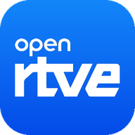
</p>

# OpenRTVE

Cliente libre de **RTVE Play** para Android y Android TV. Consulta y reproduce el
catálogo público de RTVE (televisión, radio y pódcasts) a través de sus
interfaces HTTP, con una interfaz propia en Jetpack Compose.

OpenRTVE no está afiliado a RTVE ni respaldado por ella. RTVE Play es una marca
de la Corporación de Radio y Televisión Española.

## Qué hace

- **Inicio, Buscar y Explorar**: barra inferior Material 3 en el móvil y
  panel de navegación lateral en la TV.
- **Portadas** (principal, temáticas y radio) con la presentación que dicta
  cada fila: carrusel destacado, pósters, cuadradas o apaisadas.
- **Fichas** de programa (temporadas, episodios completos paginados) y de
  vídeo o película (fondo, sinopsis, ficha técnica, reparto).
- **Buscador** con los filtros rápidos de la app oficial y resultados por
  bloque; **categorías** leídas de la configuración remota de RTVE.
- **Directos** con logo del canal, "● Directo" y progreso de la emisión;
  los programados muestran su horario. **Seguir viendo** local, sin cuenta.
- **Reproductor** Media3 con panel de ajustes (calidad, velocidad, audio,
  subtítulos), miniaturas al arrastrar, siguiente episodio con reproducción
  automática, ajuste de imagen, imagen en imagen, bloqueo, gestos (doble
  toque para saltar, deslizar para brillo y volumen), indicador de directo
  con ventana DVR, MediaSession y audio en segundo plano para radio y pódcasts.
- **DASH, HLS y MP3**, con Widevine para el contenido protegido.
- **Ajustes**: imagen en imagen, audio en segundo plano, calidad máxima,
  reproducción automática, subtítulos por defecto y borrado de caché.
- Caché con revalidación por ETag, una sola conexión HTTP/2 para catálogo e
  imágenes y allowlist estricta de hosts.

Todo se deduce de los feeds públicos de RTVE: no hay listas compiladas de
canales, categorías ni filtros.

## Capturas

### Móvil

<p>
  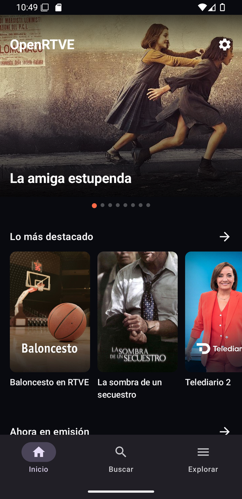
  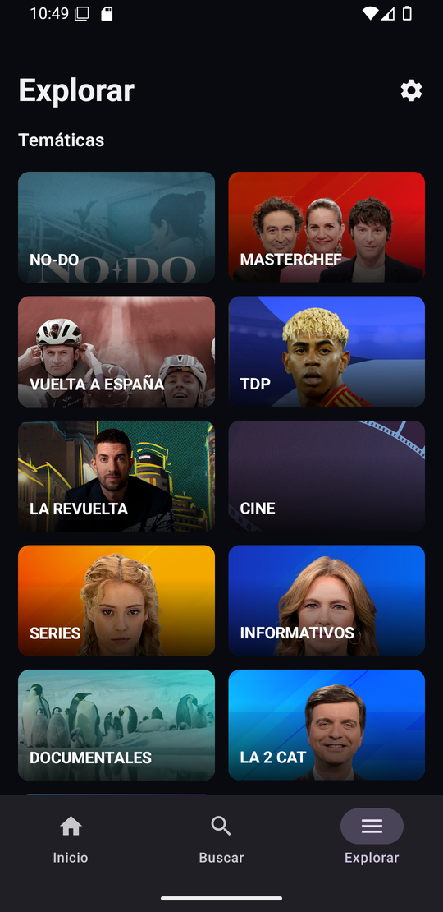
  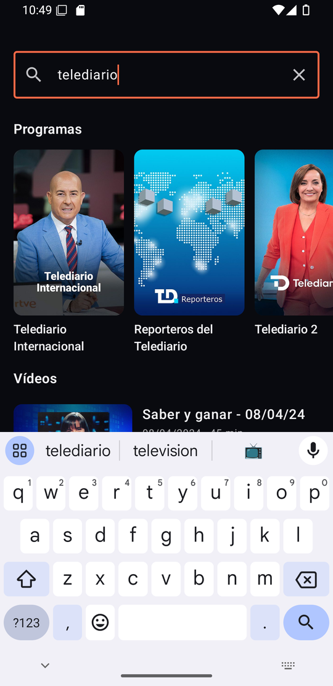
  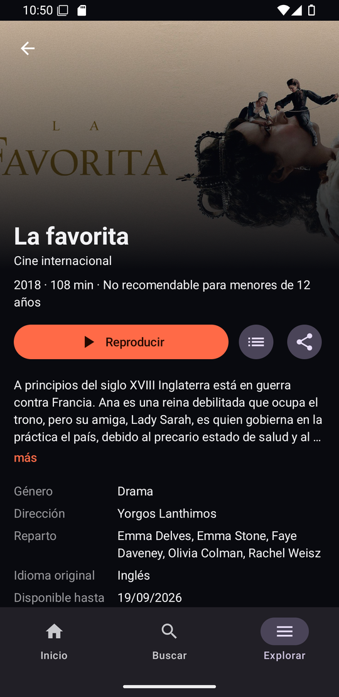
  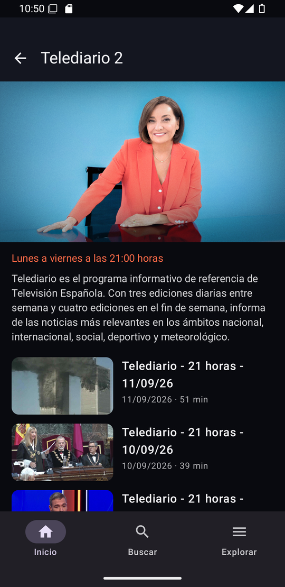
</p>
<p>
  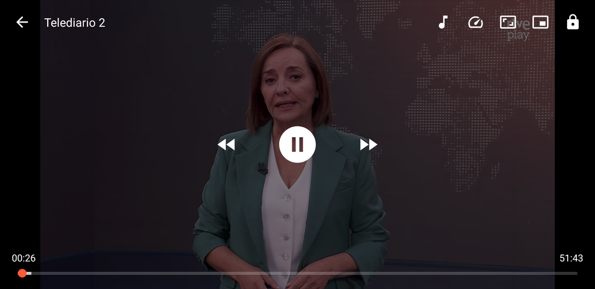
</p>

### Android TV

<p>
  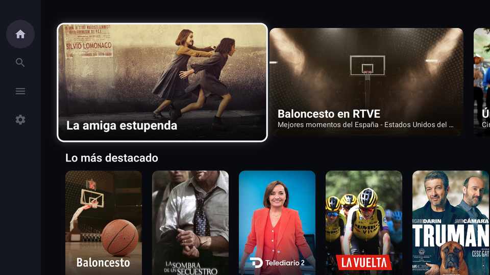
  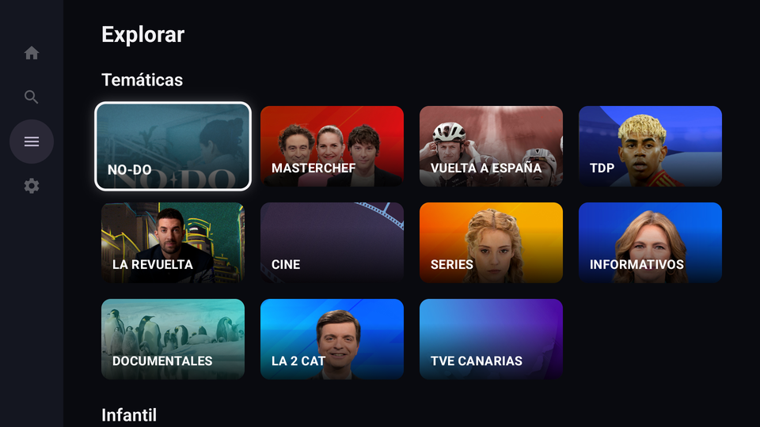
</p>
<p>
  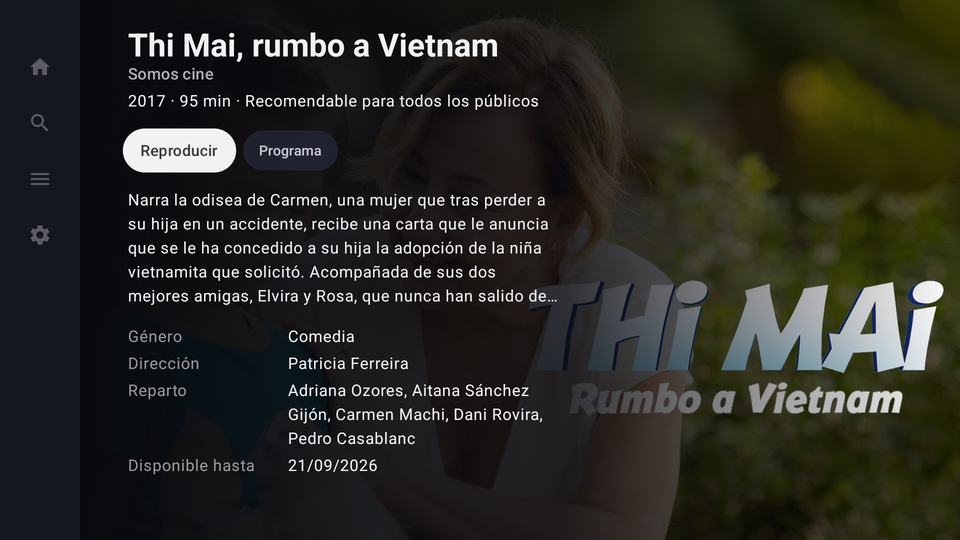
  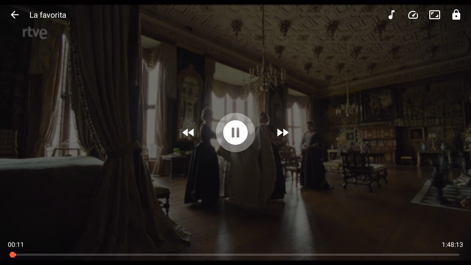
</p>

## Instalar

Descarga el APK de la sección *Releases* e instálalo en el móvil o en la TV
(en Android TV, por ejemplo con *Downloader* o `adb install`). La app detecta si
está en una TV y abre la interfaz de TV aunque el launcher lance la de móvil.

## Compilar

Con el SDK de Android instalado:

```bash
./gradlew assembleDebug          # APK de depuración
./gradlew testDebugUnitTest lintDebug
```

Sin SDK en el host, con Docker:

```bash
docker build --output type=local,dest=build/docker .
```

El APK queda en `build/docker/openrtve-debug.apk`. La imagen fija Android
Command-line Tools por versión y SHA-256, instala API 37 y Build Tools 36, y
ejecuta tests, lint y `assembleDebug`.

### Release

```bash
./gradlew assembleRelease
```

Si existe `keystore.properties` en la raíz (`storeFile`, `storePassword`,
`keyAlias`, `keyPassword`) el APK se firma con esa clave; si no, con la de
depuración para que siga siendo instalable. Keystore y propiedades están en
`.gitignore` y `.dockerignore`: guarda una copia, sin esa clave no se pueden
publicar actualizaciones sobre la app instalada.

## Diseño del código

Un único módulo `app`; los paquetes separan responsabilidades que ya tienen
comportamiento:

- `data`: cliente HTTPS sobre OkHttp, parser JSON tolerante, caché y repositorio;
- `domain`: modelos, allowlist de hosts y política de reproducción;
- `ui`: navegación (una pila por pestaña), un ViewModel por pantalla y textos;
- `ui/mobile` y `ui/tv`: los dos árboles de interfaz, que comparten todo lo demás;
- `playback`: ExoPlayer, `MediaSessionService`, controles y gestos.

No se añadirán módulos Gradle, base de datos ni framework de inyección hasta
que una función real los justifique. Las decisiones se amplían en
[docs/architecture.md](docs/architecture.md).

## Documentación de interoperabilidad

- [Contratos HTTP y modelo canónico](docs/api-contracts.md)
- [Matriz de paridad y criterios de aceptación](docs/feature-parity.md)
- [Mapa de RTVE Play 8.8.1](docs/reverse-engineering-rtve-play.md)
- [Análisis del resolver `com.rtve.ztnr`](docs/reverse-engineering-ztnr.md)

Estos documentos describen contratos HTTP públicos y comportamiento observado.
El repositorio no incorpora código decompilado, material gráfico de la
aplicación original, credenciales, claves de firma ni licencias DRM.

## Agradecimientos

El diseño de la portada, las fichas y el reproductor se inspira en
[Findroid](https://github.com/jarnedemeulemeester/findroid); el código es
propio.

## Licencia

[GPL-3.0](LICENSE).
