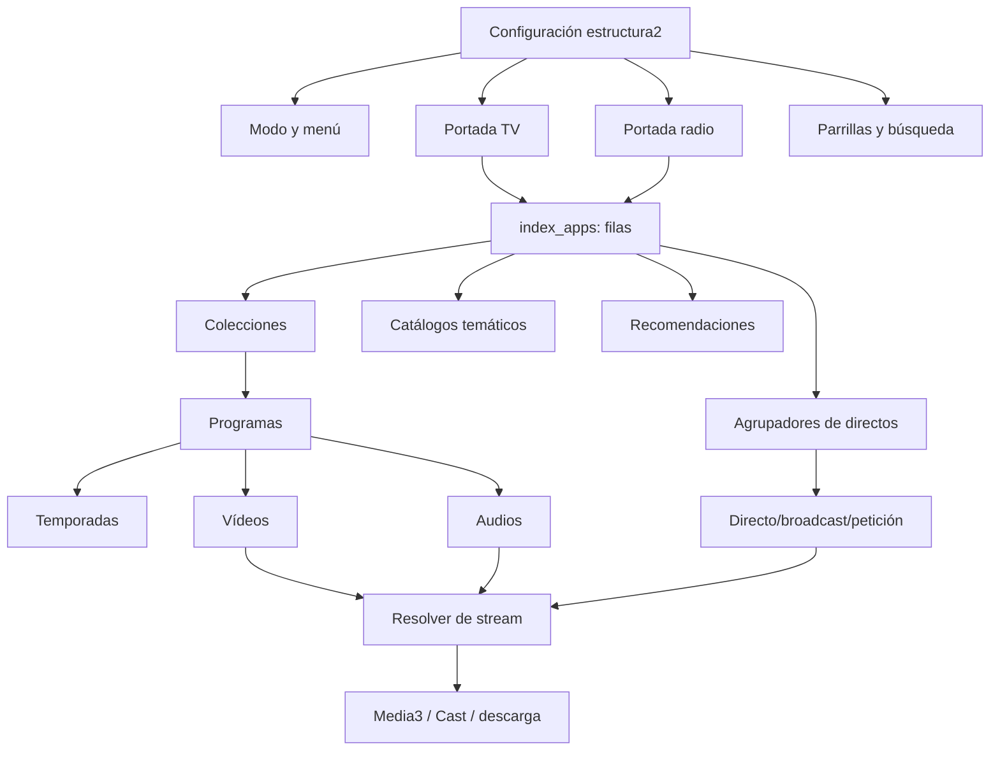
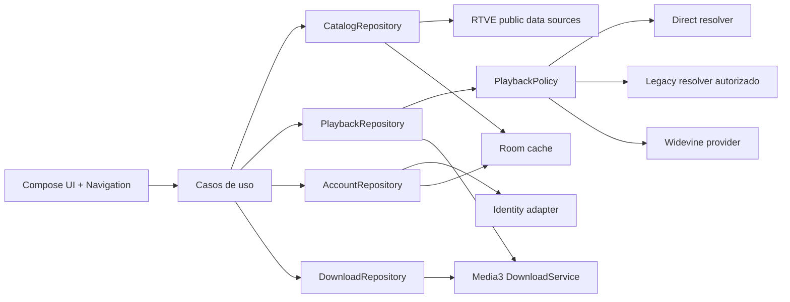

# Mapa clean-room de RTVE Play 8.8.1

## Objetivo y estado

Este documento reconstruye el comportamiento necesario para crear un cliente
Android independiente con paridad funcional respecto a RTVE Play. La unidad de
análisis es `RTVE+Play_8.8.1_APKPure.xapk`, paquete `rtve.tablet.android`,
`versionName` 8.8.1 y `versionCode` 636. El SHA-256 del XAPK es:

```text
bd1bb4ab7b0dbbcbe5908ea22a225b2b476597747a2cd2c35ba9be9ab9934ec2
```

El análisis combina tres clases de evidencia:

- **Verificado en estático**: manifiesto, bytecode y recursos del APK base.
- **Verificado por contrato público**: respuestas HTTP obtenidas el 12 de
  septiembre de 2026 de portadas, colecciones, programas, VOD, audio, directos,
  parrillas y búsqueda.
- **Pendiente de validación dinámica**: operaciones autenticadas, adquisición y
  renovación de licencias Widevine, Cast real, anuncios y restricciones que
  dependen del país o del dispositivo.

No se copia código decompilado ni se conservan credenciales, claves, tokens,
cookies, licencias o recursos gráficos de la aplicación original. Las
descripciones son especificaciones de comportamiento para una implementación
independiente.

## Resultado ejecutivo

RTVE Play es un cliente dirigido por configuración remota. La portada no es una
respuesta que incluya todos sus contenidos: es un manifiesto de módulos y cada
módulo apunta a otra fuente. Esas fuentes forman un grafo público y navegable:



La pieza `com.rtve.ztnr` solo resuelve URLs heredadas. La reproducción real usa
Media3/ExoPlayer y combina rutas directas DASH/HLS, el resolver heredado,
Widevine, IMA, Cast y almacenamiento offline. Su contrato separado está en
[reverse-engineering-ztnr.md](reverse-engineering-ztnr.md).

## Inventario del XAPK

El contenedor incluye el APK base y 19 splits de idioma, ABI y densidad. La
variante examinada declara `minSdk` 29, `targetSdk` 36 y `compileSdk` 36.

La aplicación usa, entre otras piezas:

- AndroidX Media3/ExoPlayer para vídeo, audio, MediaSession y descargas.
- Retrofit/OkHttp para los contratos HTTP.
- Google Cast para reproducción remota.
- Widevine mediante las APIs DRM de Media3.
- Google IMA para anuncios en vídeo.
- ObjectBox para estado local de reproducción y descargas.
- Gigya para identidad, sesión y perfiles.
- WorkManager, servicios foreground y notificaciones.
- OneTrust para consentimiento y Adobe/Conviva para analítica.

La interfaz está construida con actividades, fragmentos, adaptadores y XML,
incluidas variantes duplicadas para teléfono y tableta. No usa Compose. Se
observaron 43 actividades, 83 fragmentos, 66 adaptadores y dos reproductores de
vídeo grandes. Esto explica parte de la fragilidad de navegación y no debe
condicionar la arquitectura nueva.

## Arranque y configuración remota

### Secuencia observada

1. Inicializa preferencias, ObjectBox, descargas, Cast, Gigya y analítica desde
   `Application`.
2. Comprueba actualizaciones in-app y arranca OneTrust.
3. Si existe sesión Gigya, refresca la cuenta y comprueba perfiles.
4. Solicita siempre la configuración remota y la localización pública.
5. Guarda la configuración recibida en almacenamiento serializado.
6. Reconcilia el progreso remoto con vídeos y pódcast descargados.
7. Sube en lote el progreso local pendiente si hay sesión.
8. Evalúa tutoriales, avisos, promociones y versión mínima.
9. Abre la actividad principal conservando deep link o notificación inicial.

El código de red desactiva la caché HTTP. Aunque el modelo remoto contiene
`expirationTime` y `refresh`, no se observó que la sincronización inicial use
esos valores como política de caché. La implementación nueva debe aplicar
stale-while-revalidate y poder arrancar con la última configuración válida.

### Snapshot remoto verificado

La configuración consultada fue:

```text
https://www.rtve.es/m/configs/rtve_play/2026/estructura2.json
```

En el snapshot del 12-09-2026 declaraba versión 41, modificación
`2026-08-10T05:00:00`, `expirationTime=3600`, `refresh=120`,
`digitalVOD=true`, `digitaLIVE=false`, `dashon=false`, `setHistoric=true` y un
intervalo de historial de 300 segundos. Estos valores son editoriales y deben
tratarse como datos volátiles, no como constantes de compilación.

La configuración contiene:

- menú y portada de televisión;
- menú y portada de radio;
- portadas personalizadas, infantil y Play+;
- agrupadores de directos y start-over;
- parrillas TV, radio y canales FAST;
- búsqueda, A-Z, géneros y recomendaciones;
- emisoras, canales y territoriales;
- promociones, concursos, banners y avisos;
- flags de migración de streaming, anuncios, miniaturas, historial y login.

### Radio es código latente en esta versión

El modelo remoto contiene un árbol `radio` funcional y las APIs públicas siguen
respondiendo. Sin embargo, `Estructura.getAppMode()` devuelve siempre el árbol
de televisión y la preferencia `APP_MODE_PREF` solo se lee con valor por defecto
TV; no se observó ninguna escritura en el código de la app. La capa de radio
parece un remanente de una versión combinada. Nuestro cliente sí debe exponerla
como fuente de primer nivel.

## Descubrimiento y navegación del catálogo

### Portadas como manifiesto

Las portadas principales verificadas son:

```text
https://www.rtve.es/play/index_apps.json
https://www.rtve.es/play/radio/index_apps.json
```

Cada documento contiene metadatos de portada y un array `rows`. Las filas no
suelen incluir contenidos; contienen `title`, `orden`, `moduleType`, `tipo`,
`urlContent` y opciones visuales. El cliente ordena las filas y solicita cada
`urlContent` de manera perezosa.

Familias observadas:

| `moduleType` | `tipo` habitual | Semántica |
|---|---|---|
| `Collection` | `ColeccionPoster`, `ColeccionSuper`, `ColeccionSuperDestacado`, `ColeccionApaisado`, `ColeccionCuadrado*`, `ColleccionTops` | Colección editorial |
| `livesCollection` | `directosTV` | Carrusel o agrupador de directos |
| `catalogs` | `videos`, `audios`, `noticias`, `links` | Listado temático de API |
| `KeepWatching` | `seguirviendo` | Historial de usuario/local |
| `KeepListening` | `seguirescuchando` | Historial de audio |
| `Stories` | `StoriesPoster` | Feed externo de historias verticales |
| — | `moduloDirectoRadio` | Módulo local de emisoras/ahora-siguiente |

El adaptador de portada reconoce además las presentaciones `MiRtve`,
`favoritos`, `moduloNowNextCanal`, `programas`, `shorts`, `videoPoster`,
`LogoRadio`, `directosTV16`, `ColeccionDestacado`, `ColeccionPoster`,
`ColeccionCuadradoPeq`, `recomendaciones`, `Parrilla`, `Tops`,
`StoriesPoster` y una presentación de campaña (`benidorm26`). Algunas se
resuelven localmente y otras cargan `urlContent`; por eso `tipo` describe la
presentación y no debe usarse por sí solo para decidir la fuente de datos.

Los strings son abiertos: una fila desconocida debe degradarse a un módulo
genérico o ignorarse con telemetría, nunca hacer fallar la portada completa.

### Colecciones

Una colección usa `GET /api/collection/{id}.json`. La respuesta es el sobre
paginado común. Su primer item representa la colección y contiene
`collectionItems`, que pueden ser programas, VOD u otras entidades. Los
programas suelen incluir `lastMultimedia`, lo que permite una acción “reproducir
lo último” sin otra consulta.

### Programas, temporadas y episodios

Un programa se obtiene con `GET /api/programas/{id}.json`. El recurso expone
referencias a temporadas, secciones, vídeos, audios, relacionados y otros
canales. Los listados usados son:

- `/api/programas/{id}/videos.json`;
- `/api/programas/{id}/temporadas/{seasonId}/videos.json`;
- `/api/programas/{id}/audios.json`;
- `/api/programas/{id}/multimedias.json`;
- `/api/tematicas/{id}/noticias.json`;
- `/api/videos/{id}/next.json`.

El filtro `type=39816` significa contenido completo. También se observaron
39978, 39979, 39980 y 39981 para variantes de fragmento. La aplicación oficial
encadena hasta tres llamadas a `next.json`; la implementación nueva debe
modelarlo como paginación o cola incremental, sin ese límite arbitrario.

### Detalles multimedia adicionales

Se usan también:

- `/api/audios/{id}.json`;
- `/api/videos/{id}.json`;
- `/api/lives/{idAsset}.json`;
- `/api/multimedias/{id}.json` para decidir si una petición en directo es audio
  o vídeo;
- `/api/noticias/{id}.json` y
  `/api/noticias/{id}/multimedias/destacado.json`;
- `/api/imagenes/{id}.json`;
- `/api/fotogalerias/{id}/multimedias.json`.

### Directos

La portada de directos es un listado de agrupadores:

```text
GET https://api.rtve.es/api/lives/pagina-portada.json
```

Cada agrupador enlaza a `/api/lives/agr-directos/{groupId}.json`; la variante
`.../{groupId}/directos.json` entrega los canales/eventos del grupo. Se
observaron dos clases principales:

- `broadcast`: canal continuo;
- `peticion`: evento temporal, que puede requerir consultar
  `/api/lives/peticiones/{id}.json` y `/api/multimedias/{idAsset}.json`.

Al lanzar una `peticion`, la app consulta el multimedia asociado y usa su
`contentType` para enviarlo al reproductor de audio o al de vídeo. Si no obtiene
esa clasificación, degrada a vídeo. Antes de abrirlo aplica la exigencia de
login del item.

La configuración incluye `liveLocale`, una lista de `idAsset` o el comodín
`*`. Para esos directos, la versión analizada compara la hora del dispositivo
con la hora de Madrid y bloquea el lanzamiento cuando la diferencia absoluta
es de tres horas o más. Es una heurística de integridad del reloj, no una
resolución de territorio; nuestra política debe obtener una hora fiable,
separarla de la geolocalización y mostrar una causa de error específica.

Un directo puede aportar `idAsset`, `idGolumi`, `sgce`, `hasDRM`,
`requireLogged`, `live`, `inicio`, `fin`, `before`, `now`, `next`, grupo por
defecto e imágenes. No todos los campos aparecen en todos los tipos.

### Parrillas, ahora/siguiente y territoriales

Las parrillas de TV usan documentos como `/api/schedule/tv1.json`,
`la2.json`, `24h.json`, `dep.json`, `clan.json` y variantes regionales o FAST.
El contrato contiene el canal, el asset de directo, el índice actual y los
eventos con hora, duración, `idAsset` VOD y `sgce`.

Radio usa dos formas del servicio histórico:

```text
https://www.rtve.es/servicios/programasRadio/{station}.json?emision=semana
https://www.rtve.es/servicios/programasRadio/{station}.json?emision=ahora-sig
```

La configuración enumera RNE/R1, Radio Clásica/R2, Radio 3/R3, Ràdio 4/R4,
Radio 5/R5 y Radio Exterior/R6. También entrega feeds para emisoras e
informativos territoriales. La desconexión territorial de TV combina una lista
de directos con un servicio de geolocalización regional y una ventana horaria
configurada.

### Búsqueda y A-Z

La búsqueda construye:

```text
GET /api/search/results
  ?search={texto}
  &context={tve|rne|clan}
  &tipology={video|audio}
  &type=completo
```

Para perfil infantil añade `isChild=true&genre=96150`. La respuesta separa
`programs`, `videos` y, para radio, `audios`. Cada bloque contiene un sobre
paginado y un `query` relativo para pedir páginas posteriores. La app exige al
menos tres caracteres, regla que podemos mantener para evitar consultas muy
amplias.

El A-Z no es búsqueda: la configuración entrega URLs de programas por medio,
cadena o categoría, normalmente con `inazlist=true`, `small=true`, orden y un
tamaño grande.

## Modelo remoto y normalización

La aplicación original concentra más de 150 campos heterogéneos en una clase
`Item`. El mismo campo `type` puede ser objeto o string y `subType` puede faltar.
Las fechas mezclan `dd-MM-yyyy HH:mm:ss`, ISO-8601 y timestamps. Algunos IDs son
strings y otros números. Un modelo único equivalente sería frágil.

La implementación limpia debe deserializar DTOs tolerantes y normalizarlos a:

```text
Program, Season, Episode, Video, Audio, LiveChannel, LiveEvent,
Collection, EditorialModule, Schedule, ScheduleEntry, ImageSet
```

Reglas mínimas:

- conservar IDs como string;
- aceptar `type` como objeto `{id,name}` o string;
- aceptar booleanos ausentes con estado desconocido cuando afecten a derechos;
- parsear fechas con una lista explícita de formatos y `Europe/Madrid`;
- tratar HTML de descripciones como entrada no confiable y sanearlo;
- no depender de referencias URL para extraer IDs sin validar el path;
- ignorar campos adicionales para tolerar evolución del backend.

## Política de reproducción

### Comprobaciones anteriores al player

Antes de resolver un stream se evalúan:

1. descarga local disponible;
2. conectividad y permiso del usuario para datos móviles;
3. `requireLogged`;
4. `paidContent` y suscripción activa;
5. `allowedInCountry` o respuesta HTTP 403;
6. control parental por `ageRangeUid`;
7. disponibilidad temporal y `live` para eventos;
8. `notDownloadable` cuando la acción es descargar.

Estas decisiones deben vivir en `PlaybackPolicy`, no en pantallas o adapters.

### VOD de vídeo

Las rutas observadas son:

```text
https://ztnr.rtve.es/ztnr/{id}.mpd
https://ztnr.rtve.es/ztnr/tv/{id}.mpd
```

El APK elige entre ruta directa y consumer heredado según `digitalVOD`,
`segment`, `tv`, la versión Widevine, excepciones editoriales y `hasDRM`. En el
snapshot actual, `digitalVOD=true`: los assets DRM usan MPD directo y licencia;
los no DRM siguen pasando por el consumer heredado. Los flags son de migración,
por lo que la lógica debe conservarse como política remota y no como condición
dispersa.

Para contenidos Play+ autorizados, la app añade identidad y JWT a la URL de
stream. Esos datos solo pueden proceder de una sesión legítima y nunca deben
registrarse. El modo de ahorro añade `resMax=576`.

### Vídeo en directo y start-over

Sin start-over, la selección observada es:

- DRM: `https://ztnr.rtve.es/ztnr/{idAsset}.mpd` más Widevine;
- DASH habilitado: la misma ruta MPD sin DRM;
- fallback habitual: `https://ztnr.rtve.es/ztnr/{idAsset}.m3u8`;
- fallback TV: `https://ztnr.rtve.es/ztnr/tv/{idAsset}.m3u8`.

Para “ver desde el inicio”, las bases vienen de configuración. Se concatena
`idGolumi`, opcionalmente `sgce`, y uno de estos sufijos:

- `.mpd` si existe una ruta exacta válida;
- `_dvr.mpd` o `dvr.mpd`;
- `_drm.mpd` o `drm.mpd`;
- `_dvr_drm.mpd` o `dvr_drm.mpd`.

La base cambia para un suscriptor Play+ activo. La implementación nueva debe
encapsular esta composición, validar host y normalizar barras/guiones bajos.

### Audio en directo y bajo demanda

Audio VOD y directo usan el consumer heredado `PLAY_RADIO`; Cast usa un
consumer específico. Tras resolver la redirección, Media3 reproduce el MP3 con
MediaSession, metadata y servicio foreground. El contrato público de detalle de
un audio también puede ofrecer una calidad MP3 directa, por ejemplo
`https://ztnr.rtve.es/ztnr/{id}.mp3`; debe preferirse cuando sea reproducible y
esté autorizada.

La cola de pódcast se ordena por fecha cuando procede, soporta anterior,
siguiente, reproducción automática, velocidad y reanudación. El audio en
directo complementa el stream con el documento de ahora/siguiente de la
emisora.

### DRM Widevine

La aplicación consulta:

```text
GET https://api.rtve.es/api/token/{idAsset}
```

La respuesta modela `widevineURL` y un token. El player configura Widevine con
la URL de licencia; no descifra ni evita DRM. En contenido offline obtiene un
`keySetId` mediante `OfflineLicenseHelper`, comprueba la duración restante y
renueva la licencia online cuando es posible.

La app nueva solo debe implementar este flujo mediante Media3 y una sesión
autorizada. No se incorporarán licencias, claves ni mecanismos de bypass.

### Anuncios

El tag se descubre con:

```text
GET https://api.rtve.es/api/videos/{idAsset}/publicidad.json
```

La primera URL se expande con ancho, alto, cachebuster, package, estado Play+,
estado de continuar viendo, identificador de dispositivo y consentimiento
TCF/GDPR. IMA se integra como `AdsConfiguration` del `MediaItem`. Los flags
`adsLive`, `adsPre`, `adsPlayplus`, `adsTimer` y la lista `adsEnabled` gobiernan
cuándo se solicita.

Para la nueva app, consentimiento, identificadores y anuncios deben ser
opcionales, minimizados y aislados del dominio de reproducción.

### Capacidades del player que sí merece conservar

- DASH, HLS y MP3 con selección adaptativa.
- Widevine online y offline autorizado.
- selección manual y automática de audio/subtítulos;
- velocidades 0.5x, 0.75x, 1x, 1.25x y 1.5x;
- cola de episodios/clips y reproducción automática;
- previews de scrub mediante sprite + VTT;
- PiP con play/pausa;
- MediaSession, audio focus y controles de notificación;
- Cast para vídeo y audio;
- reanudación local/remota;
- start-over y volver al punto en directo.

### Cast

Cast no se limita a enviar la URL actualmente abierta. Para VOD construye una
cola a partir de la playlist editorial, localiza el item actual y ejecuta
`queueLoad` desde esa posición y el punto de reanudación. La preferencia de
reproducción automática gobierna si se añade el resto de la playlist, salvo
excepciones editoriales que fuerzan un único elemento. Cada entrada conserva
título, programa, imagen, ID de entidad, MIME y, cuando procede, datos DRM para
el receptor. Directos, audio y VOD usan contratos de media diferentes.

La resolución mantiene las mismas decisiones de derechos que el reproductor
local: país, login, suscripción, DRM y contenido especial. En una sesión
autenticada refresca el token antes de cargar; cualquier identidad necesaria
para Play+ se transmite solo al receptor autorizado y no se persiste ni se
registra. La nueva implementación debe construir la cola desde el modelo
canónico y probarla con un receptor real.

## Descargas y estado local

### Vídeo

El manifiesto offline es:

```text
https://ztnr.rtve.es/ztnr/{id}.mpd?offlineVod=true
```

Media3 descarga las pistas seleccionadas a una `SimpleCache` sin evicción y
permite tres descargas paralelas con cinco reintentos. Para DRM guarda el
`keySetId` codificado junto con la URL y metadatos. Nuestro cliente debe añadir
cuota de disco, selección explícita de calidad/idiomas, limpieza segura y
trabajos restringidos por red/batería.

Cuando Media3 marca una descarga como completada, la app crea la notificación,
persiste el item junto con la URL y la licencia offline, elimina la operación
activa y avisa a sus listeners. Si falla, elimina la operación activa, avisa del
error y cancela también las descargas pendientes. En el cliente nuevo cada
trabajo debe fallar de forma aislada: un error no debe cancelar una cola no
relacionada, y la inserción de metadata/licencia debe ser transaccional.

### Pódcast

Los pódcast se guardan como archivo en almacenamiento interno mediante un
downloader separado. La fila local conserva ID, programa, título, duración,
fecha de emisión, fecha de descarga y si ya se escuchó.

### Persistencia observada

ObjectBox contiene cuatro entidades:

| Entidad | Campos funcionales |
|---|---|
| `LocalKeepWatching` | `videoId`, progreso y duración en segundos |
| `LocalKeepHear` | `audioId`, progreso y duración en segundos |
| `PodcastDownloaded` | item/programa, títulos, duración, fecha de emisión/descarga, escuchado |
| `VideoDownloaded` | item/programa, títulos y descripciones, temporada/episodio, edad, expiración, stream, licencia offline, fecha de descarga y subtipo |

Al iniciar sesión, el arranque compara progreso remoto y local para descargas,
conserva el más avanzado y sube los cambios locales en lote. Durante vídeo, la
configuración actual solicita persistir cada 300 segundos; se guarda también al
pausar, cerrar o cambiar de episodio. A partir del 96 % el contenido se trata
como prácticamente terminado.

## Cuenta, perfiles y listas

La identidad primaria la gestiona Gigya. Después se usa un backend RTVE con base
`https://secure2.rtve.es/usuarios/services/` y header `x-jwt-rtve`. Se
observaron operaciones para:

- obtener, crear y modificar perfiles;
- perfil infantil y edad máxima;
- definir, comprobar y detectar PIN parental;
- historial, reanudación, borrado y subida en lote;
- favoritos;
- listas y contenidos de lista;
- notificar login y borrar la cuenta.

Los cuerpos de historial usan `cmsId`, `tipology`, `progress`, `duration`,
`paidContent` y `sessionId`. Las preferencias de perfil incluyen idioma,
subtítulos, idioma de descargas, autoplay y trailers. El `profileId` acompaña a
las operaciones que afectan contenido personal.

Este backend no es anónimo. Debe quedar detrás de una interfaz `AccountGateway`
y solo se habilitará con autenticación admitida por RTVE. El catálogo y la
reproducción pública no deben depender de él.

## Deep links y notificaciones

El manifiesto acepta:

```text
https://play.rtve.es/pr/{programId}
https://play.rtve.es/v/{videoId}
https://play.rtve.es/d/{liveAssetId}
https://www.rtve.es/play/videos/{permalink...}
```

Existe además la forma interna `https://play.rtve.es/content?uri={url}`. Programa
y vídeo se resuelven por API; directo crea un item con el último segmento como
`idAsset`; una URL web intenta primero un catálogo de equivalencias y, si no,
usa el último segmento como ID de vídeo.

La nueva app debe usar rutas tipadas, validar host y esquema, decodificar el
parámetro `uri` una sola vez y resolver URLs web mediante una función pura. Las
notificaciones observadas abren vídeo, directo o colección.

## Imágenes, previews y accesibilidad

Las respuestas ofrecen varias relaciones: background, banner, poster, portada,
columna, cuadrada, vertical, logos y SEO. RTVE expone además redimensionado por
URL. El cliente debe elegir por semántica y tamaño, no por una prioridad global
de campos.

Para previews se observaron:

```text
https://videopreviews.rtve.es/tiivii-previews/api/preview?idasset={ids}&customer-id=rtve
https://videopreviews.rtve.es/tiivii-previews/api/sprite?idasset={id}
```

El segundo contrato entrega imagen sprite y VTT. El MPD contiene pistas de
audio y subtítulos que Media3 expone. `subtitleRef` se usa como indicador de
accesibilidad en la interfaz, no como fuente directa del player.

## Errores y recuperación

El comportamiento observado distingue muy pocos errores: un HEAD/GET 403 se
muestra como restricción de derechos; el error Media3 1002 reabre el directo
para recuperar una ventana expirada; una petición que ya no está `live` se
muestra como emisión terminada; casi todo lo demás cae en diálogo genérico con
reintento.

La implementación nueva debe usar una taxonomía estable:

```text
NetworkUnavailable, Timeout, Http(status), InvalidPayload, NotFound,
AuthenticationRequired, SubscriptionRequired, GeoBlocked, NotStarted,
Ended, DrmUnsupported, LicenseDenied, ManifestUnavailable,
DecoderFailure, StorageFull, DownloadExpired, Unknown
```

Cada error define si es reintentable, si admite fallback HLS/DASH, el mensaje y
la acción. Los fallos de un módulo editorial no deben ocultar el resto de la
portada.

## Defectos de la aplicación original que no se copiarán

1. El cliente HTTP acepta cualquier certificado y cualquier hostname.
2. Declara tráfico cleartext y exporta numerosas actividades y servicios sin
   necesidad funcional evidente.
3. Fuerza `no-cache` y red en todas las consultas del API.
4. Ejecuta muchas llamadas bloqueantes en ejecutores creados por operación.
5. Silencia excepciones y convierte causas distintas en `null` o error genérico.
6. Mezcla navegación, red, autorización, analítica y player en actividades de
   miles de líneas y estado estático global.
7. La capa de radio está presente pero desconectada del selector de modo.
8. Duplica layouts y lógica de teléfono/tableta.
9. Limita “siguiente” a tres peticiones encadenadas.
10. Guarda identificadores y licencias offline como strings sin una frontera de
    almacenamiento seguro visible.

## Arquitectura limpia propuesta



Fronteras recomendadas:

- `remote-config`: obtiene, valida y versiona la configuración.
- `catalog`: portadas, módulos, programas, colecciones y búsqueda.
- `schedule`: directos, parrillas, now/next y territoriales.
- `playback-contract`: política y `ResolvedMedia`, sin Android UI.
- `player`: Media3, MediaSession, PiP y track selection.
- `downloads`: vídeo, audio, licencias y expiración.
- `account`: sesión, perfiles, listas, favoritos e historial.
- `cast`: traducción del modelo canónico a `MediaInfo`.
- `core-network`: TLS del sistema, allowlist de hosts, caché y observabilidad.

## Qué significa “completo” para esta versión

El mapa estático cubre los mecanismos de obtención y consumo de recursos
encontrados en 8.8.1 y se han muestreado los contratos públicos esenciales. El
decompilador estructurado dejó 26 métodos de la aplicación sin reconstruir.
Se revisó el bytecode lineal de los cuatro que podían alterar contratos de
recursos: lanzamiento de directos, construcción de la cola VOD de Cast, cambios
de estado de descarga y selección de módulos de portada. Los restantes afectan
principalmente a disposición/dibujo de UI, orden editorial y ciclo de vida; no
introducen una nueva fuente de catálogo o stream. Esto cierra el inventario
estático de adquisición para 8.8.1, pero no sustituye las pruebas dinámicas.

No es posible considerar cerrada la paridad de ejecución hasta completar, con
cuentas y dispositivos legítimos:

- captura de red de una sesión anónima, autenticada y Play+;
- Widevine L1/L3 online y offline, sin inspeccionar contenido protegido;
- pruebas desde España y fuera de España;
- Cast real de VOD, directo y audio;
- consentimiento y anuncios en varios estados;
- expiración/renovación de descarga;
- Android TV, teléfono y tableta;
- tests de contrato programados para detectar cambios de esquema.

La matriz operativa para esas pruebas está en
[feature-parity.md](feature-parity.md), y el contrato listo para implementar en
[api-contracts.md](api-contracts.md).
