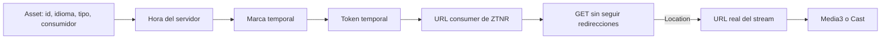

# Análisis clean-room de `com.rtve.ztnr`

## Alcance y procedencia

Este documento describe el comportamiento observable de la biblioteca incluida
en `RTVE+Play_8.8.1_APKPure.xapk`, paquete `rtve.tablet.android`, versión 8.8.1
(`versionCode` 636). El SHA-256 del contenedor analizado es:

```text
bd1bb4ab7b0dbbcbe5908ea22a225b2b476597747a2cd2c35ba9be9ab9934ec2
```

El objetivo es permitir una implementación independiente e interoperable. No se
incluyen fuentes decompiladas, recursos visuales, claves simétricas, tokens de
usuario ni material DRM.

## Resultado principal

`com.rtve.ztnr` no es el reproductor. Es un resolver de URLs heredado que toma
la identidad de un recurso, obtiene la hora del servidor, construye un token
temporal y solicita una redirección hacia el stream real.

La aplicación usa el método síncrono concreto `getURL(Asset)`. Aunque existe la
interfaz `StreamUrlResolver.resolve(Asset, Callback)`, el bytecode de esa función
solo contiene `return-void`: no invoca el callback y no resuelve nada. Esto hace
que la abstracción y la configuración Dagger asociada sean, en la práctica,
código muerto para la versión analizada.



## Contrato reconstruido

### Entrada

`Asset` contiene:

- `id`: identificador del asset.
- `language`: `es`, `en` o `ca`; por defecto `es`.
- `contentType`: vídeo o audio.
- `consumer`: perfil de dispositivo/uso.
- `endpoint`: host opcional. RTVE Play suministra `https://ztnr.rtve.es`.

Los consumidores observados son:

| Caso | Identificador público |
|---|---|
| Vídeo Android | `ulises` |
| Vídeo Android con ahorro de datos | `ulisessub` |
| Audio Android | `ninfa` |
| Vídeo Cast | `pluto` |
| Audio Cast | `hathor` |
| Vídeo DRM heredado | `ulisesDRM` |

El consumidor DRM existe en el modelo, pero no aparece como referencia directa
en el código Java recuperado. Puede pertenecer a una ruta antigua o a uno de los
métodos que JADX no reconstruyó por completo.

### Hora

La implementación síncrona consulta:

```text
https://www.rtve.es/comunes/hora/diahoracompleto.inc
```

Espera texto con patrón `dd-MM-yyyy kk:mm:ss`. Si la petición o el parseo falla,
usa la hora local del dispositivo.

La clase recibe también un `DateTime` inyectado, pero `getURL` no lo utiliza. La
implementación limpia debe reemplazar esto por un `ServerClock` inyectable y
cachear el desfase respecto al servidor.

### Token temporal

La entrada conceptual del token concatena:

```text
assetId + "_" + language + "_" + epochMillis
```

Cada consumidor selecciona una credencial distinta. Aunque la clase se llama
`BlowFishEncrypt`, el algoritmo observado es AES en modo CBC con relleno PKCS#7,
IV de ceros y salida Base64 estándar sin saltos de línea. El nombre de la clase
es, por tanto, engañoso.

Las credenciales no forman parte del contrato clean-room y no deben residir en
los recursos de una aplicación cliente. Si el endpoint consumer siguiera siendo
necesario, la firma debería realizarla un servicio autorizado o un SDK oficial.

### Construcción de la URL

Las plantillas observadas son:

```text
{endpoint}/ztnr/consumer/{consumer}/video/{token}
{endpoint}/ztnr/consumer/{consumer}/audio/{token}
```

La biblioteca se limita a devolver esta URL inicial. El llamador abre después
una conexión con redirecciones desactivadas:

- Vídeo: ante HTTP 301/302 usa `Location` y puede añadir el parámetro `id` con
  el identificador del asset. Si no hay redirección, conserva la URL inicial.
- Audio: ante HTTP 301/302 usa `Location`; en cualquier otro estado devuelve
  `null`.

No se observó tratamiento explícito de 303, 307 o 308.

## Uso real en RTVE Play 8.8.1

| Función | Resolución observada |
|---|---|
| VOD moderno | DASH directo `https://ztnr.rtve.es/ztnr/{id}.mpd` |
| VOD heredado sin DRM | Resolver consumer `ulises`/`ulisessub`, luego redirección |
| Directo sin DRM | HLS o DASH directo por `idAsset` |
| Directo con DRM | DASH directo y licencia Widevine obtenida por separado |
| Audio en directo | Resolver consumer `ninfa`, luego redirección |
| Audio VOD/pódcast | Resolver consumer `ninfa`, luego redirección |
| Cast de audio | Resolver consumer `hathor`, luego redirección |
| Descarga de vídeo | DASH `...?offlineVod=true` y licencia offline independiente |

La decisión entre la ruta directa y la heredada depende de la configuración
remota de RTVE, de las propiedades del asset, de la versión de Widevine y de la
preferencia de ahorro de datos.

## Dependencias y estructura interna

El APK contiene unas veinte clases relacionadas con ZTNR y `headinfolib`:

- Modelos `Asset`, `Consumer` y `ContentType`.
- Interfaces `StreamUrlResolver`, `Encrypt`, `DateTime` y cliente HTTP.
- Implementaciones de cifrado, hora, cabeceras y resolución.
- Un cliente Retrofit para obtener la hora.
- Módulos y factories Dagger.
- Una implementación Base64 generalista, muy superior a lo que necesita el
  resolver.

No se encontró metadata Maven, un AAR separado ni una versión publicada de la
biblioteca dentro del XAPK. Sus clases y recursos están fusionados en el APK
base.

## Defectos que no debemos copiar

1. El cliente HTTP acepta cualquier certificado y cualquier hostname.
2. `resolve(...)` incumple su contrato y nunca notifica el resultado.
3. Se hace trabajo de red síncrono y se silencian casi todas las excepciones.
4. El servidor devuelve hora de Madrid, pero el parseo usa la zona horaria del
   dispositivo; fuera de esa zona puede calcular un instante equivocado.
5. El fallback a la hora local oculta errores y puede producir tokens inválidos.
6. AES-CBC usa IV fijo y credenciales estáticas dentro de recursos Android.
7. El token Base64 estándar se concatena a una ruta sin una codificación de URL
   explícita.
8. La caché del cliente es global, mutable y no se inicializa de forma segura
   frente a concurrencia.
9. El tipo de error conserva mensaje y categoría en campos públicos, pero no
   expone correctamente la causa ni el mensaje estándar de `Exception`.
10. Hay dependencias inyectadas, interfaces y una clase `Networks` que no tienen
    efecto en el flujo utilizado.

## Diseño de la implementación independiente

La aplicación nueva debería usar este contrato:

```kotlin
interface StreamResolver {
    suspend fun resolve(request: StreamRequest): Result<ResolvedStream>
}
```

Y dividirlo en componentes pequeños:

- `DirectStreamResolver`: prueba las rutas públicas DASH/HLS admitidas.
- `LegacyConsumerResolver`: adaptador opcional, desactivado si no existe un
  firmante autorizado.
- `ServerClock`: obtiene y cachea el desfase horario usando `Europe/Madrid` de
  forma explícita.
- `RedirectResolver`: valida TLS, limita los hosts aceptados, soporta los estados
  HTTP de redirección y cierra siempre la respuesta.
- `PlaybackPolicy`: decide HLS/DASH, DRM, directo/VOD y ahorro de datos a partir
  de la configuración remota y los metadatos.
- `DrmConfigurationProvider`: crea únicamente configuraciones Widevine
  autorizadas; queda fuera del resolver ZTNR.

La prioridad será la ruta directa y pública. El protocolo consumer quedará tras
una interfaz de firma para no acoplar el cliente a credenciales estáticas ni
confundir resolución de URL con autorización.

## Pruebas clean-room necesarias

- Construcción de rutas para cada tipo y consumidor con tokens sintéticos.
- Vectores AES creados con una clave exclusivamente de prueba.
- Hora de Madrid desde dispositivos configurados en otras zonas horarias.
- Fallback controlado cuando el servidor de hora no responde.
- Redirecciones 301, 302, 303, 307 y 308 y rechazo de hosts no permitidos.
- Cancelación de corrutinas, timeouts y respuestas vacías o mal formadas.
- Selección directa HLS/DASH sin invocar el firmante heredado.
- Ausencia de tokens, cookies y URLs sensibles en logs.
